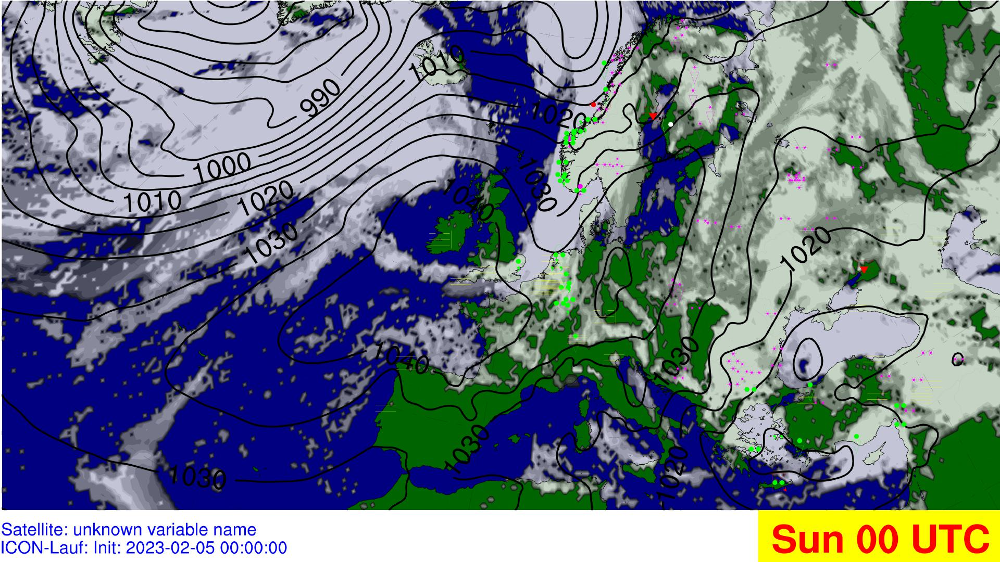

# IMUK synoptic weather wall

Using opendata from the dwd to visualize and display synoptic Data

## Current Visualisation
### Groundlevel


### 850 hPa


### 700 hPa


### 500 hPa


### 300 hPa


#Definition for station based geolocations
https://www.latlong.net

## Todos
- optimize performance

1.with changing the data

    Four notions need to investigate 
    1.1. round-off ✓ 


    round(product_array_name, 2) -> %19 increase the calculation time

    1.2. truncation analysis ✖ seems impossible atm
    1.3. numerical instability ✖ seems impossible atm
    1.4. dynamical instability ✖ seems impossible atm

2. without changing the data

I found a way is a package which is called "Cython" (C based compiler in Python). But first we need to discuss, if we decide to apply, we should write more code but it may allow us to increase the compiling time up to %30.

- json based buffrfiles


### Significant Weather
- Implent significant Weather to Groundlevel (K)
    (https://www.ncl.ucar.edu/Applications/weather_sym.shtml)
    (https://www.ncl.ucar.edu/Document/Graphics/Images/font36.png)
    (https://www.ncl.ucar.edu/Document/Graphics/Images/font37.png)
    (https://www.ncl.ucar.edu/Document/Graphics/Images/font136.png)
    (https://www.ncl.ucar.edu/Document/Graphics/Images/font137.png)
    
    

    Example: 
    #Weather SYMBOLS

        sym1res                  = Ngl.Resources() #symres = True
        sym1res.txFont           = 'weather1' #alphabetical set for severe weather icons

            symres.txFontHeightF    = 0.05 #font height
            symres.txFontColor      = 'darkorange' #font color

            symres.txFontThicknessF = 1.25 #font thickness

            sym_hail                = Ngl.add_text(wks, map, 'z', 35.75, 34.5, symres) #icon locations
            sym_torn                = Ngl.add_text(wks, map, '4', 33.10, 34.5, symres) #icon locations

        sym2res                  = Ngl.Resources() #symres = True
        sym2res.txFont           = 'weather2' #alphabetical set for severe weather icons

        sym3res                  = Ngl.Resources() #symres = True
        sym3res.txFont           = 'o_weather1' #alphabetical set for severe weather icons

        sym4res                  = Ngl.Resources() #symres = True
        sym4res.txFont           = 'o_weather2' #alphabetical set for severe weather icons


#### Generate Stationlists
  https://oscar.wmo.int/surface//index.html#/search/station#stationSearchResults
- Take a glance these links apart from the link that you sent me

    https://www.youtube.com/watch?v=Xf2YuIzVS7g
    https://www.youtube.com/watch?v=xQx2214buVU

- I found a new method to draw ground stations (I am sure that it works because I tried to use)

    https://www.pyngl.ucar.edu/Examples/Images/wmstnm02_lg.png
    https://www.pyngl.ucar.edu/Examples/Scripts/wmstnm02.py

    https://www.pyngl.ucar.edu/Examples/Images/wmstnm03.0.png
    https://www.pyngl.ucar.edu/Examples/Scripts/wmstnm03.py

- how to use guide this method in NCL

    https://www.pyngl.ucar.edu/Functions/Ngl.wmstnm.shtml

### Colors and Legends
- optimize Colorscale for 850 hPa and Groundlevel
- add ~~Infobar~~ and Legend for
-   300hpa
-   500hpa
-   700hpa
-   850hpa

### Bugs

- H and L symbol problems -> identified the issue as "cnLineLabelPlacementMode"
- https://www.ncl.ucar.edu/Document/Graphics/Resources/cn.shtml#cnLineLabelPlacementMode


### COMPLETED
- hours as an outside variable
- Accumulation to instant Rain
- 300 hPa wind speed and unit check = there is no problem, ncl converts ms to knot automatically -> clarify with M
- fixed Windbarb multiplyer
- cronjob automation
- Request.py update for twice download per day
- correct wrong windbarbs in 300hPa
- Windspeed in 300hPa (calculated and added to map)
- Transparent colors added to 300hpa wind but other colors should be changed!
- Germany Province Borders were deleted
- fix transparancy in all levels

## Deployment
### Conda
- Install miniforge: https://github.com/conda-forge/miniforge
```
 conda env create -f environment.yml
 conda activate imuk
 conda env list
```
### Crontab
- Install postfix and mutt
- copy .bashrc_conda to ~
- crontab -e
- set shell to bash and Bash enviroment:
```
- SHELL=/bin/bash
BASH_ENV=~/.bashrc_conda 
MAILTO="user"
* */1 * * *  /bin/bash ~/imuk/automation/automation.sh /dev/null
```

## Dokumentation
### Colorscale for 700 hPa
- 1-7: rgba(254, 255, 69, 1): (0.99,1,0.27,1 )
- -7.5-15 rgba(254, 253, 134, 1)(0.99,0.99,0.52,1)
- 15-22,5 rgba(254, 255, 221, 1) (0.99,0.99,0.87,1)
- 22.5 -30 rgba(253, 255, 242, 1) (0.99,0.99,0.95,1)
- 30-60 (1,1,1,0)
- 60-67.5 rgba(55, 217, 56, 1) (0.22,0.85,0.22)
- 67.5-75
- 75-82,5 
- 82,5-90
- 90-95
- 95-100 rgba(0, 119, 159, 1)(0,0.47,0.62)
### Colorscale for 300 hPa

- 1-30:Transparent 
- 31-40 : Green #33ff00
- 41-50:  Cyan #21e8ff
- >50 : Magenta #fe00fe

### Parameters for Groundlevel
Here are different parameters used to display the groundlevel documented.

#### Recommended 
##### Past
- CLCT_MOD:  cloud coverage
- PMSL: reduced surface pressure
- WW:  significant weather

##### Future
- PWSL: reduces surface pressure
- CLCT_MOD: cloud coverage
- TOT_PREC: total Precipitation

#### En detail
##### Clouds
Different Methods available:

- CLC: Cloud Cover in a single level. Multi Level
- CLCT: Total cloud cover with cirrus. Single Level
- CLCT_MOD: Modified total cloud cover, effective CLC without Cirrus. Greyscale. Single Level. Often Used in media
- Meteosat HRV/IR 10.8 Original used Satellite Data

##### Pressure
- PS: Surface pressure (not reduced). Single Level
- PMSL: Surface pressure reduced to MSL. Single Level

##### Significant weather

- WW: Significant weather of the last hour. Single Level

##### Precipitation

- TOT_PREC: Total precipitation accumulated since model start

- 3h Total precipitation accumulated original used 
