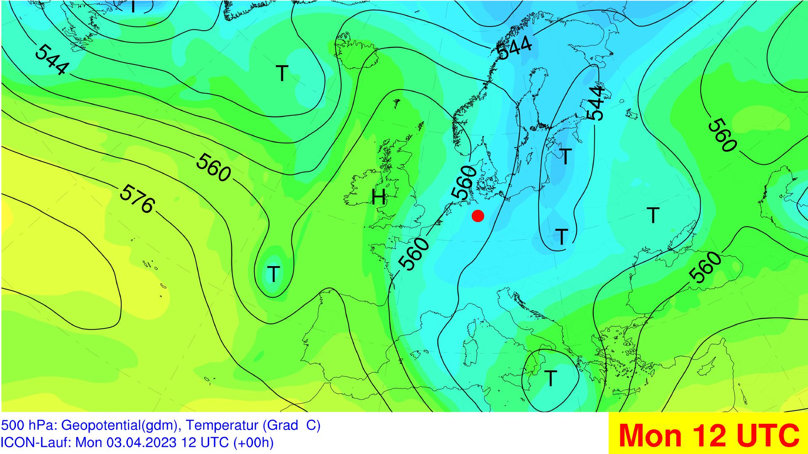
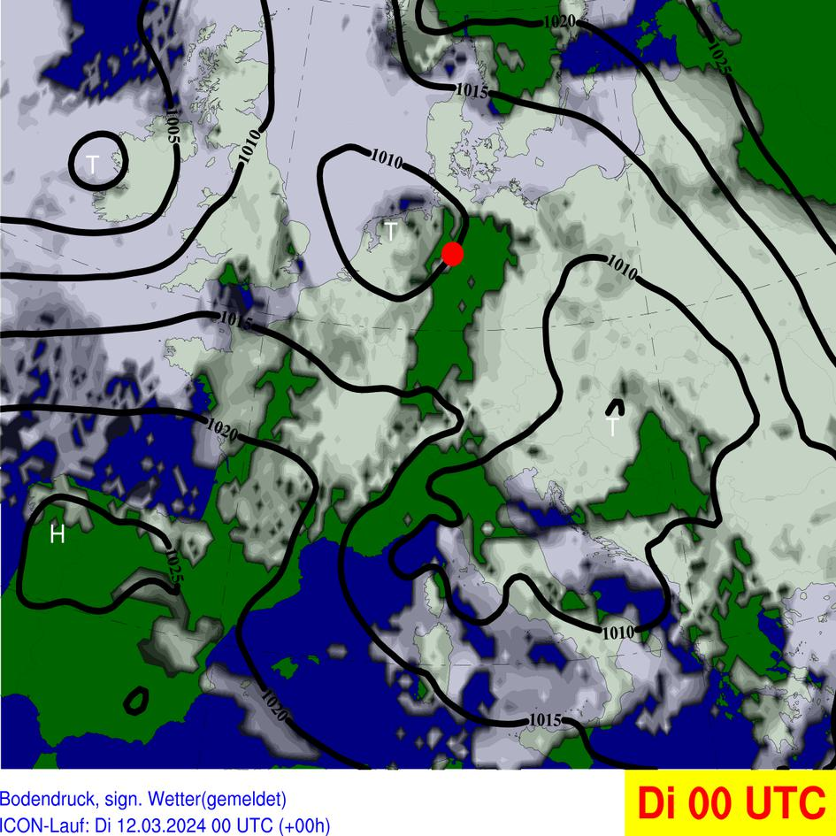

# IMUK synoptic weather wall

Using opendata from the dwd and NOAA to visualize and display synoptic Data

## Current Visualisation

### Stationmap

### Satellite

    
    

#### Radar

### Groundlevel

### 850 hPa

### 700 hPa

### 500 hPa

### 300 hPa

### TEMP

### Stationmap

### modellweather
#### 10 M Wind

#### 2 M Temp

#### 2 M Temp

### Meteogramm

## Todos
### High Priority
#### Requesting
-implement error catching for reqeuesting sats and radars

#### modellweather
- Implement Temperature values on plot
- Initialize cape Snow plot

#### Radar and Sat
- middle europe view

### Medium Priority

#### gph_maps

- optimize weathersymbols on ground level. Especially fog and dust
      https://www.pyngl.ucar.edu/Examples/Images/wmstnm02_lg.png
- show prominent station according to the significant weather

#### modellweather
- Improve Legend
- Better Colourschemes
- Orographic Elements

#### Meteogram
- init work on Meteogram

#### Other
- Move Projekt to different Host
- Find Solution for Meteosat API Acces

### Low Priority
#### gph_maps
- optimize width of pressure contours on Ground level 
#### modellweather
- Orographic Elements

## Dokumentation

### Parameters for Groundlevel
Here are different parameters used to display the groundlevel documented.

- CLC: Cloud Cover in a single level. Multi Level
- CLCT: Total cloud cover with cirrus. Single Level
- CLCT_MOD: Modified total cloud cover, effective CLC without Cirrus. Greyscale. Single Level. Often Used in media
- Meteosat HRV/IR 10.8 Original used Satellite Data

##### Pressure
- PS: Surface pressure (not reduced). Single Level
- PMSL: Surface pressure reduced to MSL. Single Level

##### Significant weather

- WW: Significant weather of the last hour. Single Level

##### Precipitation

- TOT_PREC: Total precipitation accumulated since model start

- 3h Total precipitation accumulated original used 

## Might be Useful

plot obs: 

https://unidata.github.io/MetPy/latest/tutorials/declarative_tutorial.html#sphx-glr-tutorials-declarative-tutorial-py

how to generate stationplots through metpy and cartopy
https://www.youtube.com/watch?v=3sRi4eSg52U

an extra plot for exaple
https://unidata.github.io/MetPy/latest/examples/plots/Station_Plot.html

#### Generate Stationlists
  https://oscar.wmo.int/surface//index.html#/search/station#stationSearchResults

- I found a new method to draw ground stations (I am sure that it works because I tried to use)

    https://www.pyngl.ucar.edu/Examples/Images/wmstnm02_lg.png
    https://www.pyngl.ucar.edu/Examples/Scripts/wmstnm02.py

    https://www.pyngl.ucar.edu/Examples/Images/wmstnm03.0.png
    https://www.pyngl.ucar.edu/Examples/Scripts/wmstnm03.py

- how to use guide this method in NCL

    https://www.pyngl.ucar.edu/Functions/Ngl.wmstnm.shtml

