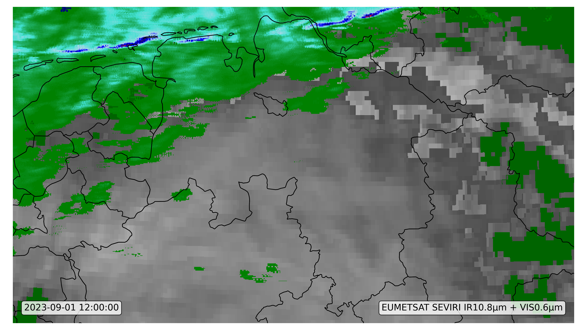
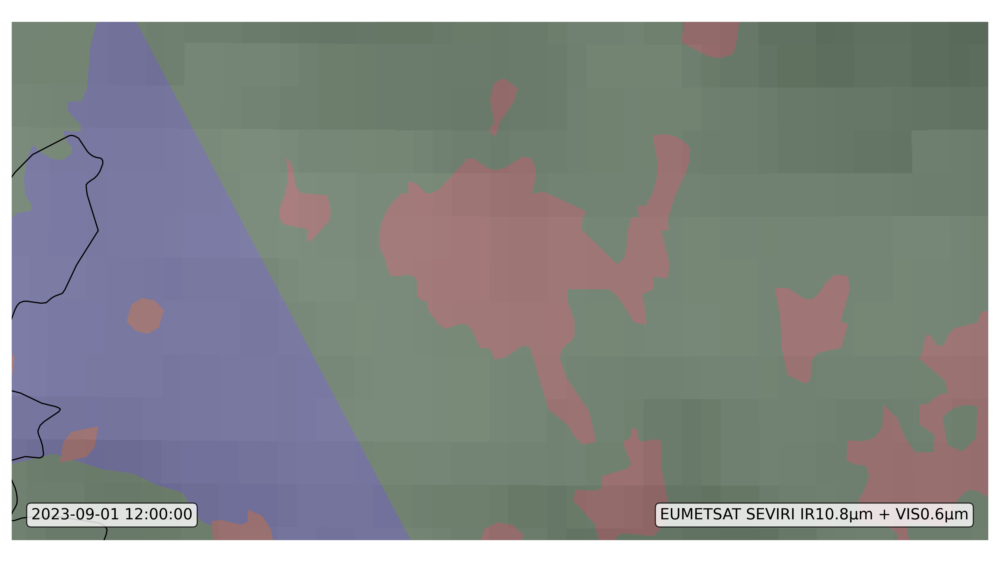
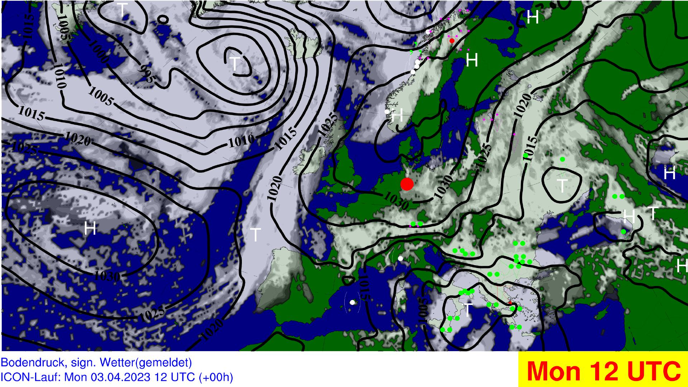

# IMUK synoptic weather wall

Using opendata from the dwd and NOAA to visualize and display synoptic Data

## Current Visualisation

### Stationmap

### Satellite

    
    

#### Radar

### Groundlevel

### 850 hPa

### 700 hPa

### 500 hPa

### 300 hPa

### Stationmap

## Todos

- optimize weathersymbols on ground level. Especially fog and dust
      https://www.pyngl.ucar.edu/Examples/Images/wmstnm02_lg.png
- show prominent station according to the significant weather

## Might be Useful

how to generate stationplots through metpy and cartopy
https://www.youtube.com/watch?v=3sRi4eSg52U

an extra plot for exaple
https://unidata.github.io/MetPy/latest/examples/plots/Station_Plot.html

#### Generate Stationlists
  https://oscar.wmo.int/surface//index.html#/search/station#stationSearchResults

- I found a new method to draw ground stations (I am sure that it works because I tried to use)

    https://www.pyngl.ucar.edu/Examples/Images/wmstnm02_lg.png
    https://www.pyngl.ucar.edu/Examples/Scripts/wmstnm02.py

    https://www.pyngl.ucar.edu/Examples/Images/wmstnm03.0.png
    https://www.pyngl.ucar.edu/Examples/Scripts/wmstnm03.py

- how to use guide this method in NCL

    https://www.pyngl.ucar.edu/Functions/Ngl.wmstnm.shtml

### Colors and Legends
- optimize Colorscale for 850 hPa and Groundlevel
- add ~~Infobar~~ and Legend for
-   300hpa
-   500hpa
-   700hpa
-   850hpa

### Bugs
### Solved
- changing the locale to German changes the Size of the yellow border in the subtitle
  >>> import datetime
  >>> import locale
  >>> locale.setlocale(locale.LC_TIME, 'de_DE')
  >>> # OR
  >>> locale.setlocale(locale.LC_TIME, 'de_DE.UTF-8')
  'de_DE.UTF-8'
  >>> d = datetime.datetime.now()
  >>> d.strftime("%a %d.%m.%Y")
  'Do 13.07.2023'
  
-  Degree Symbol ° is not support in subtitle
  in line   : ~F34~0~F~
  in string : ~S~o~N~

## Dokumentation
### Colorscale for 700 hPa
- 1-7: rgba(254, 255, 69, 1): (0.99,1,0.27,1 )
- -7.5-15 rgba(254, 253, 134, 1)(0.99,0.99,0.52,1)
- 15-22,5 rgba(254, 255, 221, 1) (0.99,0.99,0.87,1)
- 22.5 -30 rgba(253, 255, 242, 1) (0.99,0.99,0.95,1)
- 30-60 (1,1,1,0)
- 60-67.5 rgba(55, 217, 56, 1) (0.22,0.85,0.22)
- 67.5-75
- 75-82,5 
- 82,5-90
- 90-95
- 95-100 rgba(0, 119, 159, 1)(0,0.47,0.62)
### Colorscale for 300 hPa

- 1-30:Transparent 
- 31-40 : Green #33ff00
- 41-50:  Cyan #21e8ff
- >50 : Magenta #fe00fe

### Parameters for Groundlevel
Here are different parameters used to display the groundlevel documented.

#### Recommended 
##### Past
- CLCT_MOD:  cloud coverage
- PMSL: reduced surface pressure
- WW:  significant weather

##### Future
- PWSL: reduces surface pressure
- CLCT_MOD: cloud coverage
- TOT_PREC: total Precipitation

#### En detail
##### Clouds
Different Methods available:

- CLC: Cloud Cover in a single level. Multi Level
- CLCT: Total cloud cover with cirrus. Single Level
- CLCT_MOD: Modified total cloud cover, effective CLC without Cirrus. Greyscale. Single Level. Often Used in media
- Meteosat HRV/IR 10.8 Original used Satellite Data

##### Pressure
- PS: Surface pressure (not reduced). Single Level
- PMSL: Surface pressure reduced to MSL. Single Level

##### Significant weather

- WW: Significant weather of the last hour. Single Level

##### Precipitation

- TOT_PREC: Total precipitation accumulated since model start

- 3h Total precipitation accumulated original used 
